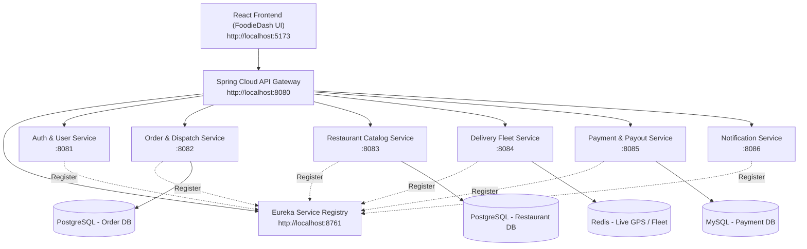

# Spring Boot Microservices Architecture — Food Delivery System

This document outlines the end-to-end architecture and implementation guide for transitioning **FoodieDash** from mock data to a resilient **Spring Boot Microservices Architecture** featuring **Eureka Service Registry**, **Spring Cloud API Gateway**, and microservices for domain operations.

---

## 1. Architecture Overview



---

## 2. Microservice Domains & Responsibilities

| Service Name | Port | Primary Responsibilities | Database | Key APIs |
| :--- | :--- | :--- | :--- | :--- |
| **eureka-service-registry** | `8761` | Service discovery and health monitoring for all registered instances. | In-Memory | `/eureka` UI dashboard |
| **api-gateway** | `8080` | Central entry point, OAuth2 JWT validation, rate limiting, and dynamic routing via Eureka. | None (Stateless) | All incoming `/api/v1/**` requests |
| **user-service** | `8081` | Customer accounts, admin RBAC (Alex/Prabina profile), address books. | PostgreSQL (`users_db`) | `/api/v1/users`, `/api/v1/auth/login` |
| **order-service** | `8082` | Order lifecycle (Pending -> Preparing -> Out for Delivery -> Delivered), item breakdown. | PostgreSQL (`orders_db`) | `/api/v1/orders`, `/api/v1/orders/{id}/status` |
| **restaurant-service** | `8083` | Restaurant catalog, dietary tags (Veg/Non-Veg), menu items, cuisine categories. | PostgreSQL (`restaurant_db`) | `/api/v1/restaurants`, `/api/v1/menus` |
| **delivery-fleet-service** | `8084` | Courier onboarding, live GPS telemetry, battery levels, vehicle assignments. | Redis / Spatial DB | `/api/v1/fleet`, `/api/v1/deliveries/live` |
| **payment-service** | `8085` | Payment gateway integration, earnings distribution, platform fees. | PostgreSQL (`payment_db`) | `/api/v1/payments`, `/api/v1/payouts` |
| **notification-service** | `8086` | Real-time WebSocket/SSE alerts, SMS notifications for order stage updates. | MongoDB / Redis | `/api/v1/notifications`, `/ws/alerts` |

---

## 3. Recommended Project Directory Structure

```
foodiedash-backend/
├── eureka-server/           # Eureka Service Registry (Port 8761)
├── api-gateway/             # Spring Cloud Gateway (Port 8080)
├── user-service/            # User Auth & Profile Service (Port 8081)
├── order-service/           # Order Lifecycle & Dispatch Service (Port 8082)
├── restaurant-service/      # Menu & Restaurant Service (Port 8083)
├── fleet-service/           # Driver Fleet & GPS Tracking (Port 8084)
├── payment-service/         # Billing & Settlements (Port 8085)
└── docker-compose.yml       # Local orchestration container runner
```

---

## 4. Key Configuration Snapshots

### 4.1 Service Registry (`eureka-server`)

**Dependencies** (`pom.xml`):
```xml
<dependency>
    <groupId>org.springframework.cloud</groupId>
    <artifactId>spring-cloud-starter-netflix-eureka-server</artifactId>
</dependency>
```

**Main Application**:
```java
package com.foodiedash.eureka;

import org.springframework.boot.SpringApplication;
import org.springframework.boot.autoconfigure.SpringBootApplication;
import org.springframework.cloud.netflix.eureka.server.EnableEurekaServer;

@SpringBootApplication
@EnableEurekaServer
public class EurekaServerApplication {
    public static void main(String[] args) {
        SpringApplication.run(EurekaServerApplication.class, args);
    }
}
```

**`application.yml`**:
```yaml
server:
  port: 8761

eureka:
  instance:
    hostname: localhost
  client:
    registerWithEureka: false
    fetchRegistry: false
```

---

### 4.2 API Gateway (`api-gateway`)

**Dependencies** (`pom.xml`):
```xml
<dependency>
    <groupId>org.springframework.cloud</groupId>
    <artifactId>spring-cloud-starter-gateway</artifactId>
</dependency>
<dependency>
    <groupId>org.springframework.cloud</groupId>
    <artifactId>spring-cloud-starter-netflix-eureka-client</artifactId>
</dependency>
```

**`application.yml` Route Routing**:
```yaml
server:
  port: 8080

spring:
  application:
    name: api-gateway
  cloud:
    gateway:
      globalcors:
        cors-configurations:
          '[/**]':
            allowedOrigins: "http://localhost:5173"
            allowedMethods:
              - GET
              - POST
              - PUT
              - PATCH
              - DELETE
            allowedHeaders: "*"
      routes:
        - id: order-service
          uri: lb://ORDER-SERVICE
          predicates:
            - Path=/api/v1/orders/**

        - id: restaurant-service
          uri: lb://RESTAURANT-SERVICE
          predicates:
            - Path=/api/v1/restaurants/**

        - id: fleet-service
          uri: lb://FLEET-SERVICE
          predicates:
            - Path=/api/v1/fleet/**, /api/v1/deliveries/**

        - id: user-service
          uri: lb://USER-SERVICE
          predicates:
            - Path=/api/v1/users/**, /api/v1/auth/**

eureka:
  client:
    service-Url:
      defaultZone: http://localhost:8761/eureka/
```

---

### 4.3 Microservice Spring Client Example (`order-service`)

**Dependencies**:
```xml
<dependency>
    <groupId>org.springframework.boot</groupId>
    <artifactId>spring-boot-starter-web</artifactId>
</dependency>
<dependency>
    <groupId>org.springframework.boot</groupId>
    <artifactId>spring-boot-starter-data-jpa</artifactId>
</dependency>
<dependency>
    <groupId>org.springframework.cloud</groupId>
    <artifactId>spring-cloud-starter-netflix-eureka-client</artifactId>
</dependency>
```

**`application.yml`**:
```yaml
server:
  port: 8082

spring:
  application:
    name: order-service
  datasource:
    url: jdbc:postgresql://localhost:5432/orders_db
    username: postgres
    password: postgres_password
  jpa:
    hibernate:
      ddl-auto: update
    show-sql: true

eureka:
  client:
    service-Url:
      defaultZone: http://localhost:8761/eureka/
```

---

## 5. React Frontend Integration Strategy

Replace static array imports in `src/data/mockData.ts` with an HTTP API Service ([src/services/apiService.ts](file:///e:/AI-ComputerAutomation/src/services/apiService.ts)):

```typescript
import axios from 'axios';

const API_BASE_URL = 'http://localhost:8080/api/v1';

export const apiService = {
  // Orders API
  getOrders: async () => {
    const response = await axios.get(`${API_BASE_URL}/orders`);
    return response.data;
  },
  updateOrderStatus: async (orderId: string, status: string) => {
    const response = await axios.patch(`${API_BASE_URL}/orders/${orderId}/status`, { status });
    return response.data;
  },
  // Fleet API
  getLiveDeliveries: async () => {
    const response = await axios.get(`${API_BASE_URL}/deliveries/live`);
    return response.data;
  },
};
```

---

## 6. Implementation Milestones

1. **Step 1: Bootstrap Multi-Module Maven / Gradle project** or separate repositories for `eureka-server`, `api-gateway`, and core domain microservices (`order-service`, `restaurant-service`, `fleet-service`).
2. **Step 2: Configure Eureka Server (`8761`) & API Gateway (`8080`)** with CORS rules pointing to `http://localhost:5173`.
3. **Step 3: Implement Spring Data JPA Models & Controllers** matching `Order`, `Restaurant`, `DeliveryPartner` TypeScript contracts.
4. **Step 4: Connect React App to API Gateway** via Axios / React Query for real-time status updates.
